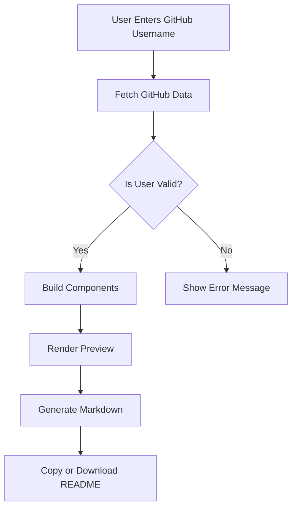

# 🚀 ProReadmeGen

[](https://github.com/ZainulabdeenOfficial/ProReadmeGen)

A powerful GitHub Profile README Generator with real-time stats and customization...

# 🚀 GitHub Profile README Generator

A dynamic, beautiful web application that generates stunning GitHub Profile READMEs with **real-time data** from the GitHub API. Built with Next.js, TypeScript, and Tailwind CSS - optimized for Vercel deployment.

[](https://vercel.com/new/clone?repository-url=https://github.com/yourusername/github-readme-generator)

## ✨ Features

### 🎯 **Real-Time Data Integration**
- Fetches live GitHub user data, repositories, and statistics
- Displays actual commit counts, stars, and follower information
- Shows real programming language usage statistics
- Includes genuine repository information and descriptions

### 🎨 **Beautiful Design**
- Modern, responsive UI with GitHub's design language
- Dark theme optimized for developer experience
- Smooth animations and hover effects
- Mobile-friendly responsive design

### 🛠️ **Advanced Customization**
- **12 Complete Sections** following the advanced template structure
- Toggle individual components (stats, languages, trophies, etc.)
- Multiple theme options (Dark, Light, Tokyo Night)
- Customizable social links and personal information

### 📊 **Dynamic Components**
- **GitHub Stats Cards** - Live statistics with beautiful charts
- **Streak Stats** - Contribution streak tracking
- **Language Stats** - Top programming languages with usage percentages
- **Trophy Collection** - Achievement badges
- **Activity Graph** - Contribution activity visualization
- **Visitor Counter** - Profile view tracking
- **Typing Animation** - Dynamic text effects

### 🚀 **Advanced Features**
- **Hero Section** with animated welcome banner
- **About Me** with bio and personal information
- **What Sets You Apart** - Unique selling points
- **Tech Stack** with badge generation
- **Featured Projects** from actual repositories
- **Custom Sections** including coding principles and fun facts
- **Connect Section** with social media integration
- **Call to Action** with engagement elements

## 🏗️ Quick Start

### 1. Clone & Install
```bash
git clone https://github.com/yourusername/github-readme-generator.git
cd github-readme-generator
npm install
```

### 2. Environment Setup (Optional but Recommended)
Create a `.env.local` file:
```bash
# Optional: GitHub Personal Access Token for higher rate limits
GITHUB_TOKEN=your_github_personal_access_token
```

**Getting a GitHub Token:**
1. Go to [GitHub Settings > Personal Access Tokens](https://github.com/settings/personal-access-tokens/tokens)
2. Generate a new token
3. Select scope: `public_repo` (for accessing public repositories)
4. Copy the token and add it to your environment variables

### 3. Run Development Server
```bash
npm run dev
```

Open [http://localhost:3000](http://localhost:3000) to see the application.

## 🚀 Deploy to Vercel

### One-Click Deploy
[](https://vercel.com/new/clone?repository-url=https://github.com/yourusername/github-readme-generator)

### Manual Deployment
1. **Push to GitHub** - Push your code to a GitHub repository
2. **Connect to Vercel** - Import your repository on [Vercel](https://vercel.com)
3. **Add Environment Variables** (Optional):
   - Go to Project Settings > Environment Variables
   - Add `GITHUB_TOKEN` with your GitHub personal access token
4. **Deploy** - Vercel will automatically build and deploy your application

### Environment Variables on Vercel
```
Name: GITHUB_TOKEN
Value: your_github_personal_access_token
```

## 📱 How to Use

### 1. **Enter GitHub Username**
- Input any public GitHub username (e.g., `torvalds`, `octocat`)
- Click "Generate README" to fetch user data

### 2. **Customize Your README**
- Toggle components you want to include:
  - ✅ GitHub Stats
  - ✅ Top Languages
  - ✅ Streak Stats
  - ✅ Trophies
  - ✅ Activity Graph
  - ✅ Featured Repositories
  - ✅ Visitor Count
  - ✅ Typing Animation
- Choose your preferred theme

### 3. **Generate & Copy**
- Click "Generate Amazing README"
- Preview the result in real-time
- Copy the markdown or download the file
- Paste into your GitHub profile repository's `README.md`

## 🎯 Template Structure

Our generator creates READMEs with **12 comprehensive sections**:

1. **👋 Hero Section** - Animated welcome with typing effects
2. **🧠 About Me** - Personal bio and information
3. **🚀 What Sets Apart** - Unique value propositions
4. **🛠️ Tech Stack** - Programming languages and tools with badges
5. **📊 GitHub Stats** - Live statistics and visualizations
6. **📚 Currently** - Current activities and interests
7. **📁 Featured Projects** - Top repositories with descriptions
8. **🎨 Custom Sections** - Coding principles, schedule, milestones
9. **🧰 Daily Tools** - Development environment and tools
10. **📬 Connect** - Social media links and contact information
11. **🎁 Sponsor** - Support and sponsorship options
12. **📌 Call to Action** - Engagement and collaboration invites

## 🔧 Technical Architecture

### **Frontend Stack**
- **Next.js 14** - React framework with App Router
- **TypeScript** - Type-safe development
- **Tailwind CSS** - Utility-first styling
- **Framer Motion** - Smooth animations
- **React Hot Toast** - Beautiful notifications

### **Data Sources**
- **GitHub REST API** - User data, repositories, statistics
- **GitHub Stats API** - Dynamic stat cards and charts
- **Shields.io** - Custom badges and icons
- **Real-time Services** - Live visitor counts and typing animations

## 🔧 Project Workflow


---


### **Key Features**
- **Server-Side Rendering** - Fast initial page loads
- **Client-Side Interactions** - Dynamic user experience
- **API Rate Limiting** - Efficient GitHub API usage
- **Error Handling** - Graceful failure management
- **Responsive Design** - Works on all devices

## 🤝 Contributing

We welcome contributions! Here's how to help:

1. **Fork the repository**
2. **Create a feature branch**: `git checkout -b feature/amazing-feature`
3. **Commit changes**: `git commit -m 'Add amazing feature'`
4. **Push to branch**: `git push origin feature/amazing-feature`
5. **Open a Pull Request**

### Development Guidelines
- Follow TypeScript best practices
- Maintain consistent code style
- Add tests for new features
- Update documentation as needed

## 📝 License

This project is licensed under the MIT License - see the [LICENSE](LICENSE) file for details.

## 🙏 Acknowledgments

- **GitHub API** - For providing comprehensive user data
- **Vercel** - For excellent hosting and deployment experience
- **GitHub Community** - For inspiration and feedback
- **Open Source Contributors** - For making this project possible

<div align="center">

**⭐ Star this repository if you found it helpful!**

Made with ❤️ for the GitHub community

</div> 
